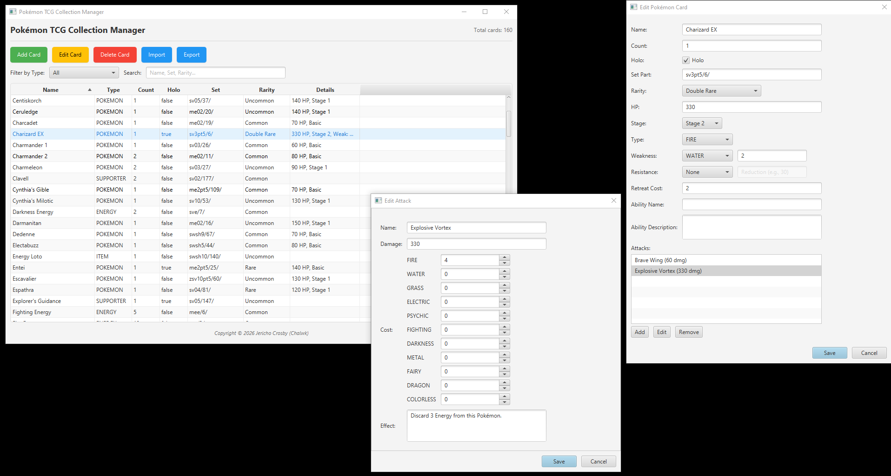

# Pokémon TCG Collection Manager

A desktop application for managing your Pokémon TCG collection. Built with JavaFX, it allows you to
catalog cards, track counts, and store detailed information including attacks, abilities, and rarity.



---

## Features

- **Add, Edit, Delete** cards with an intuitive form.
- Support for multiple card types:
    - Pokémon cards (HP, stage, type, weakness, resistance, retreat cost, abilities, attacks)
    - Trainer cards (Supporter, Item, Tool, Stadium)
    - Energy cards
- **Filter** by card type and **search** by name, set, or rarity.
- **Import/Export** collection data as JSON files.
- Persistent storage in a local JSON file.
- Double-click a row to edit a card.
- Works on Windows, macOS, and Linux.

### JSON Import/Export - The Heart of the Application

The ability to **export your collection to JSON** and **import it back** is arguably the most important feature of this
manager. It gives you:

- **Complete portability** - take your collection file anywhere, share it with friends, or use it in other tools.
- **Reliable backups** - never lose your data; save copies in multiple locations.
- **Human‑readable format** - JSON is easy to inspect, edit, or even generate programmatically.
- **Interoperability** - the structured data can be consumed by other applications, websites, or scripts.

Exported JSON files contain all card details exactly as they appear in the app. Here's a snippet from a real collection
file:

```json
{
  "ENERGY": [
    {
      "name": "Fire Energy",
      "count": 18,
      "holo": false,
      "setPart": "sve/2/",
      "rarity": "Common",
      "attacks": []
    },
    {
      "name": "Water Energy",
      "count": 27,
      "holo": false,
      "setPart": "sve2/11/",
      "rarity": "Common",
      "attacks": []
    }
  ],
  "SUPPORTER": [
    {
      "name": "Clavell",
      "count": 2,
      "holo": false,
      "setPart": "sv02/177/",
      "rarity": "Common",
      "attacks": []
    }
  ],
  "POKEMON": [
    {
      "name": "Charizard EX",
      "count": 1,
      "holo": true,
      "setPart": "sv3pt5/6/",
      "rarity": "Double Rare",
      "attacks": [
        {
          "name": "Brave Wing",
          "damage": 60,
          "cost": ["FIRE"],
          "effect": "If this Pokémon has any damage counters on it, this attack does 100 more damage."
        },
        {
          "name": "Explosive Vortex",
          "damage": 330,
          "cost": ["FIRE","FIRE","FIRE","FIRE"],
          "effect": "Discard 3 Energy from this Pokémon."
        }
      ],
      "hp": 330,
      "stage": "Stage 2",
      "type": "FIRE",
      "weakness": ["WATER","2"],
      "resistance": null,
      "retreatCost": 2,
      "ability": null
    },
    {
      "name": "Abra",
      "count": 1,
      "holo": false,
      "setPart": "me01/54/",
      "rarity": "Common",
      "attacks": [
        {
          "name": "Teleportation Attack",
          "damage": 10,
          "cost": ["PSYCHIC"],
          "effect": "Switch this Pokémon with 1 of your benched Pokémon"
        }
      ],
      "hp": 50,
      "stage": "Basic",
      "type": "PSYCHIC",
      "weakness": ["DARKNESS","2"],
      "resistance": ["FIGHTING","-30"],
      "retreatCost": 1,
      "ability": null
    },
    {
      "name": "Pikachu",
      "count": 1,
      "holo": true,
      "setPart": "sv02/63/",
      "rarity": "Double Rare",
      "attacks": [
        {
          "name": "Pika Punch",
          "damage": 30,
          "cost": ["COLORLESS"],
          "effect": ""
        },
        {
          "name": "Dynamic Bolt",
          "damage": 220,
          "cost": ["LIGHTNING","COLORLESS"],
          "effect": "Flip a coin. If tails, discard all Energy from this Pokémon."
        }
      ],
      "hp": 190,
      "stage": "Basic",
      "type": "ELECTRIC",
      "weakness": ["FIGHTING","2"],
      "resistance": null,
      "retreatCost": 0,
      "ability": null
    }
  ]
}
```

---

## Prerequisites

- **Java 21** or later (JDK)
- **Gradle** (optional - the project includes the Gradle Wrapper)

---

## Getting Started

### Installation

1. Clone the repository:
   ```bash
   git clone https://github.com/chalwk/PokemonTCGCollectionManager.git
   cd PokemonTCGCollectionManager
   ```

2. Build and run the application:
   ```bash
   ./gradlew run
   ```

   Or, if you prefer to run via the executable JAR (after building):
   ```bash
   ./gradlew clean build
   java -jar build/libs/PokemonTCGCollectionManager-1.0.0.jar
   ```

### Building a Platform‑Specific Installer

The project is configured to create a Windows installer (`.exe`) via `jpackage` using the `jlink` plugin. To build the
installer, run:

```bash
./gradlew jpackage
```

The resulting installer will be placed in `build/jpackage/`. For other operating systems, modify the `jlink`
configuration in `build.gradle` (change `installerType`).

---

## Usage

### Main Window

- **Add Card**: Opens a dialog to create a new card.
- **Edit Card**: Select a card and click *Edit* (or double‑click the row).
- **Delete Card**: Removes the selected card after confirmation.
- **Import/Export**: Load or save your collection as a JSON file.

### Card Details

- **Regular Cards** (Energy, Trainer): name, count, holo, set part, rarity, attacks.
- **Pokémon Cards**: All of the above, plus:
    - HP
    - Stage (Basic, Stage 1, Stage 2)
    - Type (Fire, Water, etc.)
    - Weakness (type + multiplier)
    - Resistance (type + reduction value)
    - Retreat Cost
    - Ability (name + description)

### Searching & Filtering

- Use the **type filter** drop‑down to show only one category.
- Enter text in the **search field** to filter by name, set name, or rarity.

---

## File Storage

- By default, collection data is stored in:
  ```
  %USERPROFILE%/PokemonCollection/pokemon_collection.json  (Windows)
  ~/PokemonCollection/pokemon_collection.json              (macOS/Linux)
  ```
- Use **Export** to save a copy elsewhere, and **Import** to load a previously saved file.

---

## License

This project is licensed under the MIT License. See the [LICENSE](LICENSE) file for details.

Copyright © 2026 Jericho Crosby (Chalwk)

---

## Acknowledgements

- [JavaFX](https://openjfx.io/) for the UI framework
- [Jackson](https://github.com/FasterXML/jackson) for JSON serialization
- [Gradle](https://gradle.org/) for build automation

---

## Contact

For issues or suggestions, please open an issue
on [GitHub](https://github.com/chalwk/PokemonTCGCollectionManager/issues).